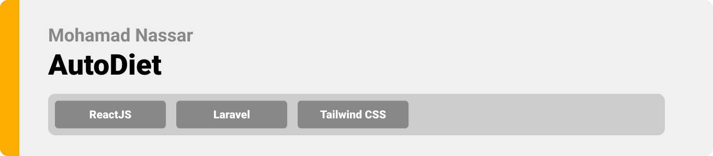
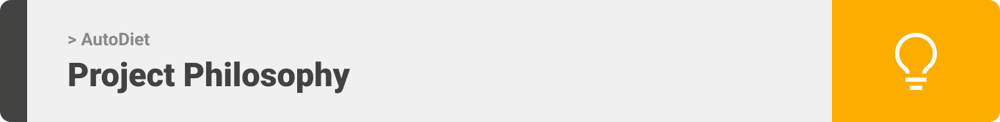
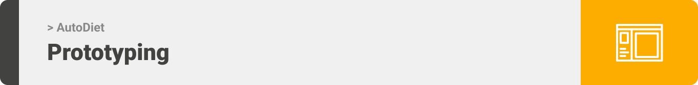
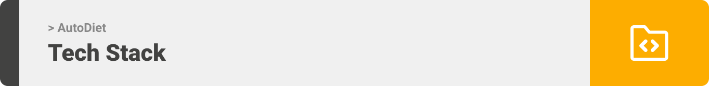
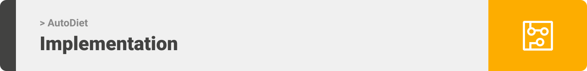
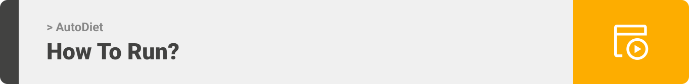

<div align="center">

> Hello world! This is the project’s summary that describes the project plain and simple, limited to the space available. 


**[PROJECT PHILOSOPHY](https://github.com/moenassar0/autodiet#user-stories) • [WIREFRAMES](https://github.com/moenassar0/autodiet#wireframes) • [TECH STACK](https://github.com/moenassar0/autodiet#stacks) • [IMPLEMENTATION](https://github.com/moenassar0/autodiet#implementation) • [HOW TO RUN?](https://github.com/moenassar0/autodiet#prerequisites)**

</div>

<br><br>



> AutoDiet is an automatic meal planner that is customized to the user's needs. The web app generates a daily plan for the user with dynamic recipes with the user's overall nutrition and health in mind.
> The app will also allow the user to log in data like his own diet/meals and weight.
> The web app prompts the user to input his physical details first, the user can then generate his own mealplans. The user can also surf all the avaiable meals and their recipes.

### User Stories
- As a user, I want to organize my daily mealplan, so that I be more efficient
- As a user, I want to know my daily nutrition goals, so that I can become healthier
- As a user, I want to browse recipes, so that I use them or be inspired by them

<br><br>



> This design was first made on Figma as wireframes then formed into mockups. You will see the design of the website changing along the way as better color palettes and design patterns were used. First let's see the wireframes:

### Wireframes

| Landing  | Browse Foods/Meals  |
| -----------------| -----|
|  |  |

| User's Profile  | User's Mealplan  |
| -----------------| -----|
|  |  |

### Mockups

| Landing  | Browse Foods/Meals  |
| -----------------| -----|
|  |  |

| User's Profile  | User's Mealplan  |
| -----------------| -----|
|  |  |


<br><br>



### Stacks

Let us briefly mention the tech stack and technologies the application used:

- This application was built using the ReactJS library. ReactJS [React](https://www.reactjs.org) helps us move from the daunting task of writing vanilla JavaScript by offering its rich library that builds single page applications using components.
- For the backend we used the framework built for web artisans [Laravel](https://laravel.com). Laravel was used purely for the api calls and database connection. For the database we used MySQL.
- Firebase was also used as part of our backend. Firebase helped the application send push notifications to the user as well as help build our chatting system using real-time databases.
- The app uses the font ["Poppins"](https://fonts.google.com/specimen/Poppins) as its main font.
- The app utilizes ChartJs for its multiple uses of pie charts and line charts to display data such as nutrition to the user.


<br><br>


### Implementation

> Utilising our wireframes and mockups built using Figma, along with the tech stacks and user sotries we have, the implementation of the app is shown as below. The following images and gifs are screenshots from the actual deployed application.

| Landing  | Meals Page  |
| -----------------| -----|
|  |  |


| User's Profile  | User's Mealplan  |
| -----------------| -----|
|  |  |


| User's Weightlog  | User's Dietlog  |
| -----------------| -----|
|  |  |


| Dark/Light modes  | Live chat  |
| -----------------| -----|
|  |  |

<h2> Admin Panel Screenshots/gifs </h2>

| Admin CRUD  | Admin Chat  |  Admin create/link recipes  |  
| -----------------| -----|-----|
|  |  |  |


<br><br>



> This is an example of how you may give instructions on setting up your project locally.
To get a local copy up and running follow these simple example steps.

### Prerequisites

This is an example of how to list things you need to use the software and how to install them.
* NodeJS
  ```sh
  https://nodejs.org/en/download/
  ```
* composer
  ```sh
  (https://getcomposer.org/)
  ```

### Installation

_Below is an example of how you can instruct your audience on installing and setting up your app. This template doesn't rely on any external dependencies or services._

1. Clone the repo
   ```sh
   git clone https://github.com/moenassar0/autodiet/
   ```
2. Install NPM packages
   ```sh
   npm install
   ```
3. Install composer packages
   ```sh
   composer install
   ```
4. Setup your .env file in the frontend and backend folders. Connect your MySQL database and Firebase app using the .env.example files.
5. Run the migrations (inside your laravel project)
   ```sh
   php artisan migrate
   ```

### Important Note
For the application to properly function, you will need a already populated database with meals, foods, and recipes added.
